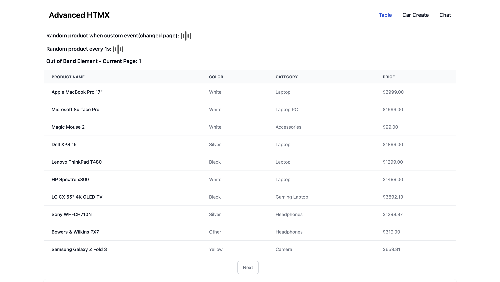
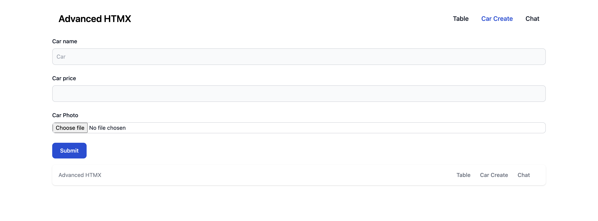
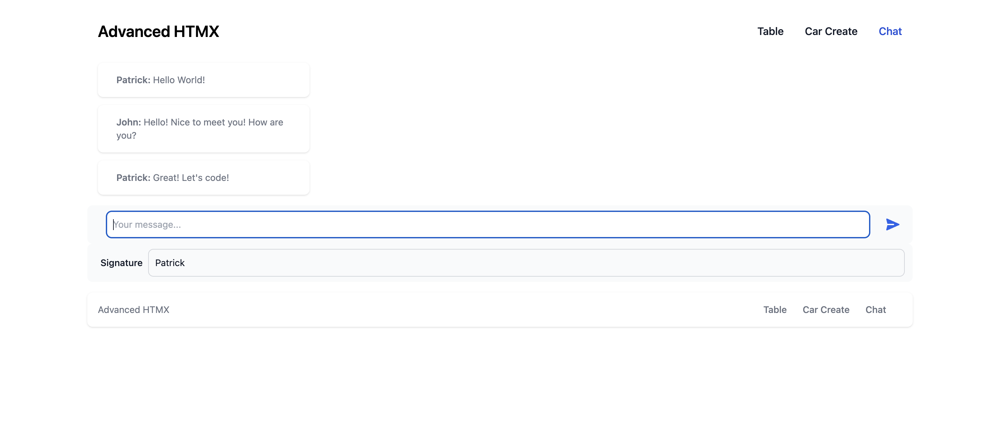

# Django project with HTMX and Tailwind CSS

This Django project demonstrates the use of HTMX and Tailwind CSS to create interactive web applications.


## Getting Started

### Prerequisites

Before you can run this application, make sure you have the following prerequisites installed:

- Python 3.x
- Docker and Docker Compose
- pip-tools

### Running the Application

To launch the application, execute the following command:

```bash
make up
```

## Available Commands (using Make)

Here are some handy `make` commands to manage and interact with the project:

- **`make update-deps`**: Update Python dependencies using pip-tools.

- **`make up`**: Run the application using Docker Compose.

- **`make down`**: Stop the running application.

- **`make build`**: Manually build the Django project using Docker.

- **`make attach`**: Attach to the `myproject` Docker container (enter into the Django project container).

- **`make bash`**: Open a bash shell inside the `myproject` Docker container.

- **`make shell`**: Open a Python shell with IPython inside the `myproject` Docker container.

- **`make migrate`**: Run database migrations inside the `myproject` Docker container.

- **`make migrations`**: Generate database migration files inside the `myproject` Docker container.

- **`make collectstatic`**: Collect static files inside the `myproject` Docker container.

- **`make run-build`**: Build a Docker image for development purposes.

- **`make run`**: Run the `myproject` Docker container with environment variables from .env.

Feel free to use these commands to streamline your development workflow and interact with the project effortlessly.

## Tests

To launch written tests, run application and execute the following command:

```bash
make tests
```

## Advanced Usage with HTMX

This app showcases the advanced capabilities of HTMX, making your web application more dynamic and user-friendly. We've implemented several advanced features that leverage the power of HTMX:

### 1. Interactive Tables with Pagination



Here you'll find interactive tables with features such as:

- **hx-swap-oob:** We use the `hx-swap-oob` attribute to update specific parts of the page without reloading the entire page, enhancing the user experience.

- **hx-trigger="load":** The `hx-trigger="load"` attribute is employed for automatic initialization of requests as soon as the page loads. This preloads data and ensures a seamless user experience.

- **Pagination:** We've integrated pagination with HTMX, enabling users to navigate through data efficiently.

### 2. File Uploads with Django Forms



We've streamlined file uploads in your Django application using HTMX. Our project demonstrates how to easily handle file uploads with HTML forms and the `hx-encoding` attribute set to "multipart/form-data" This feature works seamlessly with Django forms, making it a breeze to implement file upload functionality.

### 3. Real-Time Chat with Django Channels



Take your communication to the next level with real-time chat functionality powered by Django Channels. Our chat feature showcases the integration of WebSockets and HTMX, enabling instantaneous messaging and interactions between users.

These advanced HTMX features enhance the overall user experience, making your web application more dynamic, interactive, and efficient. Explore our project to see these features in action and gain insights into how to implement them in your own applications.
